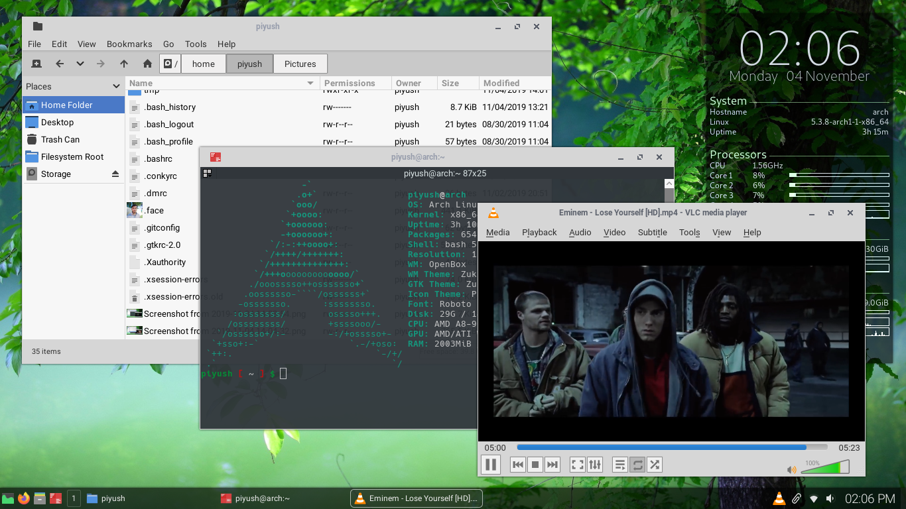

# KOpenbox dotfiles
How is the screenshot above? It almost look like KDE, isn't it? Have a look at ram usage its near 260MB. 

## Introduction
KOpenbox is a collection of config files and method to setup lightweight and minimal good looking linux desktop. Config file are present in reposetory. 

**Warning: I don't recommend to clone the whole reposetory in your home folder!**

## Procedure
I use(recommend) Arch Linux but everything will work on any distro. 

### Requirements
 * openbox
 * tint2
 * conky
 * compton
 * nitrogen
 * pcmanfm-gtk3 (optional)
 * obmenu-generator
 * rofi
 * diodon
 * pa-applet
 * network-manager-applet
 * polkit-gnome
 * dunst
 * sxhkd
 * qt5ct
 * qt5-styleplugins
 * lxappearance-gtk3
 * obconf
 * papirus-icon-theme
 * pavucontrol
 * terminator
 * gnome-screenshot
 * Roboto font
 * Hack font
 * Cantarell font

move `Zukitre-mod` to `~/.themes` or  `/usr/share/themes`

### Configure openbox
Openbox is window manager. Configuration for openbox is stored in `~/.config/openbox`

#### `autostart` - script file that is executed on login

In autostart you can uncomment `pcmanfm --desktop &` and comment `nitrogen --restore &` using # symbol, if you wish to use pcmanfm to manage desktop. I personally use nitrogen. Using pcmanfm will enable you to add desktop icons.

#### `menu.xml` - configuration for openbox(right click) menu

You can copy it as it is. Menu is generated with obmenu-generator.

#### `rc.xml` - configuration for openbox(right click) menu

You can copy it as it is. You can configure it using obconf if you wish. If you are configuring it using obconf don't forget to select `Zukitre-mod`.

### Configure tint2
Tint2 is panel. Configuration for tint2 is stored in `~/.config/tint2` . You can copy it as it is. If you wish to configure it, you can click right most corner of tint2 to open GUI tool to configure it.

### Configure conky
Conky displays desktop widgets. Configuration for conky is stored in `~/.conkyrc` . If you have more aor less number of cpu core you can change config accordingly.

### Configure compton
It is compositor. Configuration for compton is stored in `~/.config/compton.conf` . You can copy it as it is but if you wish you can change.

### Configure nitrogen
Nitrogen sets wallapaper of your desktop. To set wallapaper. execute in bash

`nitrogen [name of folder]`

Now select image you want to use and select 'Zoomed Fill'.

### Configure pcmanfm (if used)
Right click on desktop to open menu there you can find option to configure.

### Configure obmenu-generator
It generates menu for obmenu-generator. Configuration for tint2 is stored in `~/.config/obmenu-generator` . You can copy it as it is but if you wish you can change.

### Configure rofi
Theme is present in `~/.local/share/rofi`
To select theme execute in bash

`rofi-theme-selector` 

Now select 'Paper-top'.

### Configure dunst
It generates desktop notifications. Configuration for dunst is stored in `~/.config/dunst` .
You can copy it as it is but if you wish you can change.

### Configure sxhkd
It controls hotkeys. Configuration for sxhkd is stored in `~/.config/sxhkd` .
You can copy it as it is but if you wish you can change.

### Configure qt5ct
It sets theme for qt applications. First add `QT_QPA_PLATFORMTHEME=qt5ct` in `/etc/environment` and rebooot. 
Now launch qt5ct either from terminator or press <super\> + grave(`) and launch it from rofi drun. 
Select `gtk2` as style, `roboto Regular 10p` as general font, `hack Regular 9` as fixed width font and `Papirus` as icons.

### Configure lxappearance
It sets theme for gtk applications. Now launch lxappearance either from terminator or press <super\> + grave(`) and launch it from rofi drun. 
Select `Zukitre-mod` as theme. `roboto Regular 10p` as Default font and `Papirus` as icons. 

### Configure terminator
It is terminal emulator for us. Configuration for terminator is stored in `~/.config/terminator` .
You can copy it as it is but if you wish you can change.

### Configure bash
Configuration for terminator is stored in `~/.bashrc` .
You can copy it as it is but if you wish you can change.

## Finish
Here is list of few softwares I'm using with KOpenbox. If you wish you can try and if you've someting better I'll love to have a try.

* lightdm - Login Manager.
* pcmanfm - Filemanager
* firefox - Web Browser
* file-roller - Archiver
* geany - Text Editor
* gimp - Image Editor
* viewnior - Image Viewer
* vlc - Audio and Video Player
* Atril - Document Viewer (PDF)
* lxtask - Task Manager 
* hardinfo - Hardware and Software Infocenter

